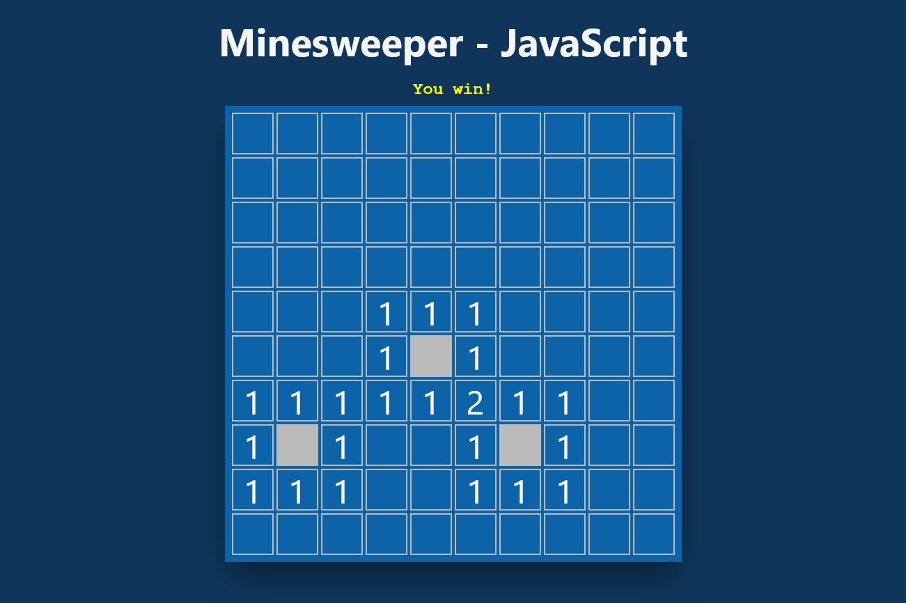

  <a href="https://luvagu.github.io/minesweeper-vanilla-js">
    
    <h1 align="center">Minesweeper - JavaScript</h1>
  </a>

The old and beloved Minesweeper game of all time built with `Vanilla JavaScript`.

## Main Features

- Play `Minesweeper`
- Indicates when a player `wins` or `loses`
- Mark or unmark possible mines
- Reveal nearby mines with number indicator

Try the demo account at: https://luvagu.github.io/minesweeper-vanilla-js

Enjoy!
